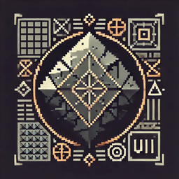

<p align="center">
  
</p>

<h1 align="center">Valheim-Veneer</h1>

<p align="center">
  <a href="https://github.com/Slatyo/Valheim-Veneer/releases"></a>
  <a href="https://opensource.org/licenses/MIT"></a>
</p>

<p align="center">
  Reusable UI component library for Valheim mods.<br>
  Build consistent, modular UI with panels, buttons, tooltips, and more.
</p>

## Features

- **VeneerPanel** - Draggable panels with title bar, close button, and content area
- **VeneerButton** - Styled buttons (Primary, Secondary, Danger, Ghost)
- **VeneerText** - Text with preset styles (Header, Body, Caption, Value)
- **VeneerTooltip** - Rich tooltips that follow the mouse cursor
- **VeneerNotify** - Toast notifications and center-screen alerts
- **VeneerColors** - Consistent color palette including rarity colors
- **VeneerTheme** - Global theming configuration
- **Input Management** - Automatic input blocking and cursor control

## Installation

### Thunderstore (Recommended)
Install via [r2modman](https://valheim.thunderstore.io/package/ebkr/r2modman/) or [Thunderstore Mod Manager](https://www.overwolf.com/app/Thunderstore-Thunderstore_Mod_Manager).

### Manual
1. Install [BepInEx](https://valheim.thunderstore.io/package/denikson/BepInExPack_Valheim/)
2. Install [Jotunn](https://valheim.thunderstore.io/package/ValheimModding/Jotunn/)
3. Place `Veneer.dll` in `BepInEx/plugins/`

## Quick Start

```csharp
using Veneer;

// Create a panel
var panel = VeneerUI.CreatePanel(new PanelConfig
{
    Title = "My Panel",
    Width = 400,
    Height = 300,
    Style = PanelStyle.Wood,
    BlockInput = true
});

// Add content
VeneerUI.CreateText(panel.Content, new TextConfig
{
    Text = "Welcome!",
    Style = TextStyle.Header
});

var button = VeneerUI.CreateButton(panel.Content, new ButtonConfig
{
    Text = "Click Me",
    Style = ButtonStyle.Primary
});

button.OnClick += () => VeneerNotify.Toast("Clicked!", NotifyType.Success);

// Show it
panel.Show();
```

## API Reference

### VeneerUI
```csharp
VeneerUI.CreatePanel(PanelConfig config)
VeneerUI.CreateButton(Transform parent, ButtonConfig config)
VeneerUI.CreateText(Transform parent, TextConfig config)
VeneerUI.RegisterToggle(VeneerPanel panel, KeyCode key, string name)
```

### VeneerTooltip
```csharp
VeneerTooltip.Show(string text)
VeneerTooltip.Show(TooltipConfig config)
VeneerTooltip.ShowItem(ItemDrop.ItemData item)
VeneerTooltip.Hide()
```

### VeneerNotify
```csharp
VeneerNotify.Toast(string message, NotifyType type)
VeneerNotify.Persistent(string message, NotifyType type)
VeneerNotify.Alert(string message, float duration)
```

### VeneerInput
```csharp
VeneerInput.BlockGameInput(bool block)
VeneerInput.OnEscape += () => { }
```

## Why Veneer?

Building UI in Unity/Valheim mods means:
- Duplicating panel code across mods
- Inconsistent styling and behavior
- Repeated tooltip implementations
- Managing input blocking manually

Veneer solves this by providing a shared component library that:
- Matches Valheim's visual aesthetic
- Handles common patterns (dragging, closing, input blocking)
- Provides consistent API across all components

## Contributing

See [CONTRIBUTING.md](CONTRIBUTING.md) for development setup and guidelines.

## License

[MIT](LICENSE) © Slatyo
